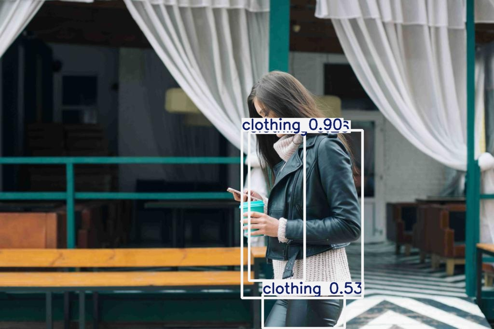
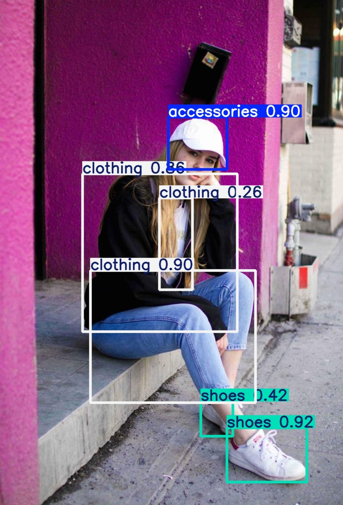
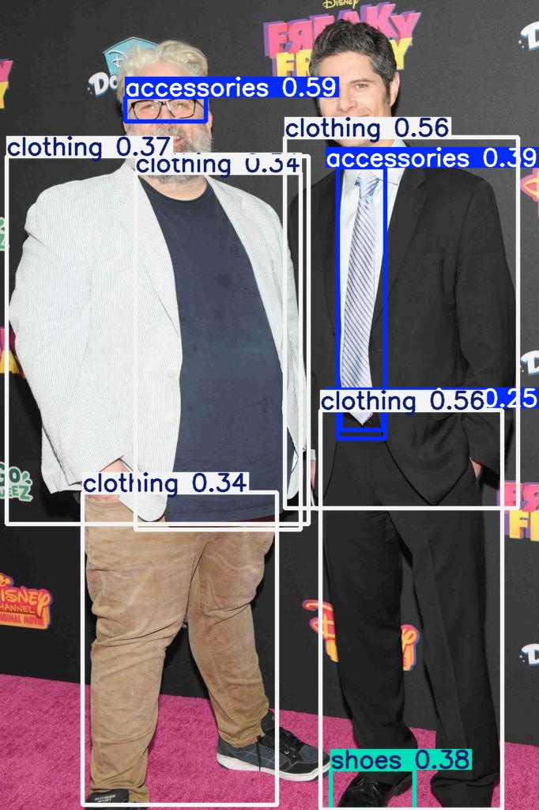

# YOLO-Clothing-Detection


In this repo YOLO model is finetuned to detect clothing using a reduced version of [fashionpedia]. It contains four categories:
  - Clothing
  - Shoes
  - Bags
  - Accessories


First you need to run data_preprocessing.py to change the format of data to desired format of ultralytics library.

The output dataset directory structure will be like the following:
```
datasets/
└── fashion_dataset/
    ├── images/
    │   ├── train/
    │   ├── val/
    │   └── test/
    └── labels/
        ├── train/
        ├── val/
        └── test/
```

Then you can train the model using model_training.py. 
Lastly to test models on images you can use model_test notebook.
Here are some results from the trained model on test set:






# Helpful resources

YOLO explanation: https://www.youtube.com/watch?v=9s_FpMpdYW8&list=WL&index=20
YOLO explanation in depth: https://www.youtube.com/watch?v=svn9-xV7wjk&list=WL&index=19
Mean Average Precision (mAP) explanation and coding: https://www.youtube.com/watch?v=FppOzcDvaDI
Intersection Over Union (IoU) explanation and coding: https://www.youtube.com/watch?v=XXYG5ZWtjj0 (High noise warning for the start of the video :D )


[fashionpedia]: https://huggingface.co/datasets/detection-datasets/fashionpedia_4_categories